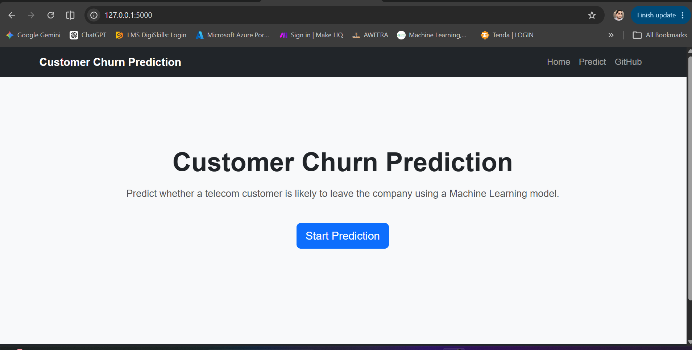
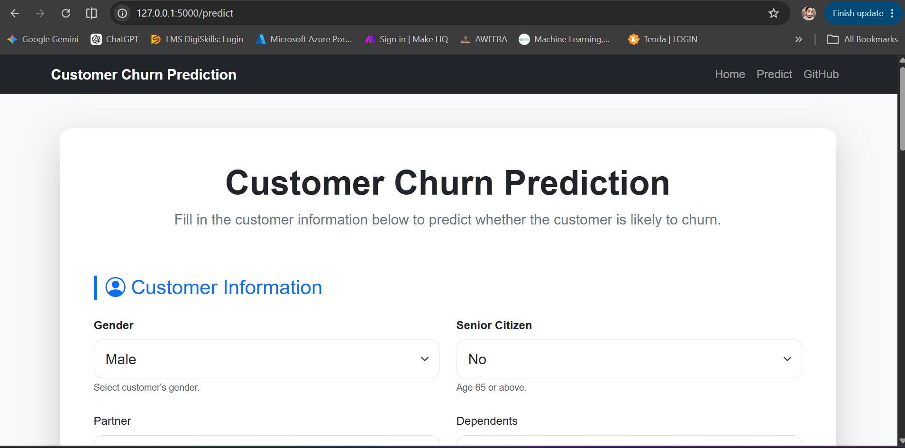
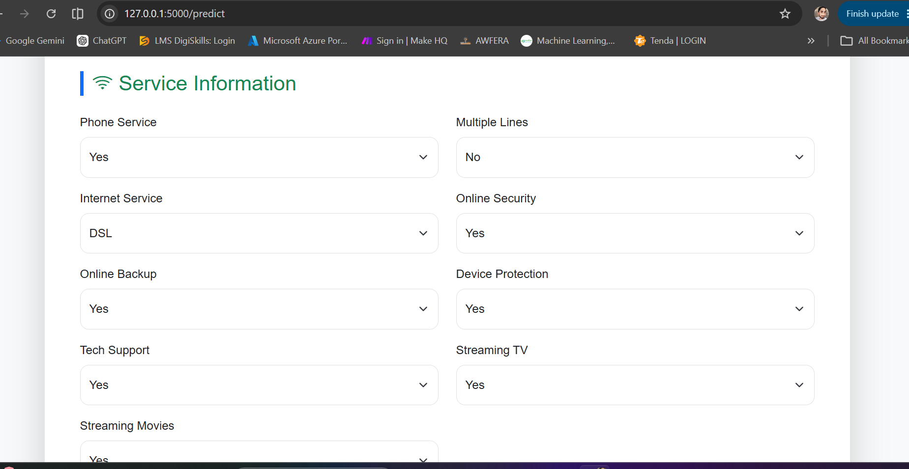
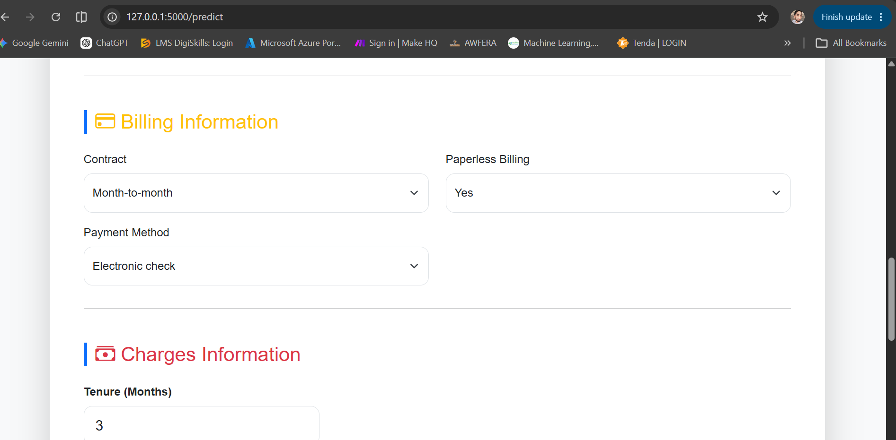
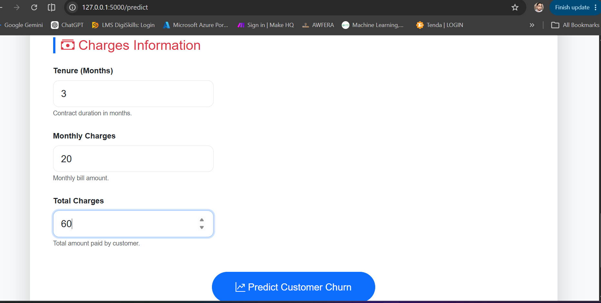
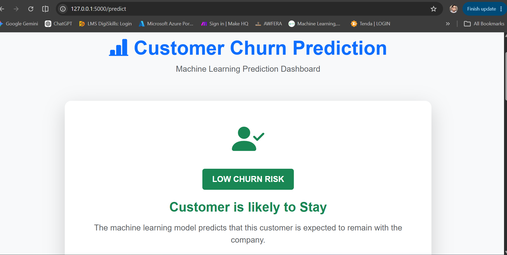
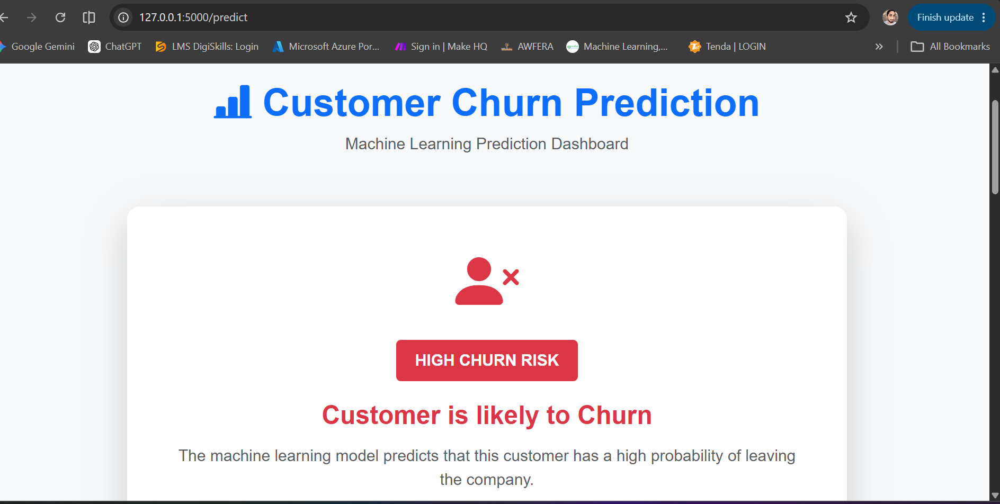

# Customer Churn Prediction Flask App

A Machine Learning web application that predicts whether a customer is likely to churn or stay using a Logistic Regression model deployed with Flask.

---

## Project Overview

Customer churn prediction helps businesses identify customers who are likely to leave their services. This project uses a machine learning pipeline to preprocess customer data and predict churn through an interactive Flask web application.

---
## Live Demo

🌐 https://project-3-customer-churn-prediction.onrender.com

---

<h2>Application Screenshots</h2>

<p align="center">




</p>
<p align="center">




</p>

<p align="center">





</p>

## Features

- Customer churn prediction
- Data preprocessing using Scikit-learn Pipeline
- Automatic feature scaling and encoding
- Logistic Regression classifier
- Prediction probability
- Professional dashboard UI
- Dynamic business recommendations
- Customer summary
- Responsive Bootstrap interface
- Flask backend
- Production-ready project structure

---

## Machine Learning Workflow

1. Data Collection
2. Data Cleaning
3. Data Preprocessing
4. Feature Engineering
5. Train-Test Split
6. Pipeline Creation
7. Model Training
8. Model Evaluation
9. Hyperparameter Tuning
10. Model Selection
11. Model Serialization using Joblib
12. Flask Integration
13. Deployment

---

## Dataset

Dataset: Telco Customer Churn

Target Variable

- Churn

Number of Records

- 7043

Features

- 20 Input Features
- 1 Target Variable

---

## Technologies Used

- Python
- Flask
- Pandas
- NumPy
- Scikit-learn
- Joblib
- HTML5
- CSS3
- Bootstrap 5
- JavaScript

---

## Machine Learning Models Compared

- Logistic Regression ✅ Selected
- Decision Tree
- Random Forest
- Gradient Boosting

---

## Evaluation Metrics

| Metric | Score |
|---------|------:|
| Accuracy | 80.64% |
| Precision | 66.07% |
| Recall | 55.46% |
| F1 Score | 60.30% |
| ROC-AUC | 84.66% |

---

## Project Structure

```
customer_churn_prediction_flask_app/
│
├── app.py
├── config.py
├── requirements.txt
├── README.md
│
├── models/
│   └── customer_churn_pipeline.pkl
│
├── routes/
│   └── prediction.py
│
├── services/
│   └── prediction_service.py
│
├── utils/
│   └── model_loader.py
│
├── templates/
│   ├── base.html
│   ├── index.html
│   ├── predict.html
│   └── result.html
│
└── static/
    ├── css/
    ├── js/
    └── images/
```

---

## Installation

Clone the repository

```bash
git clone https://github.com/junaidramzan-ai-dev/customer_churn_prediction_flask_app.git
```

Move into the project

```bash
cd customer_churn_prediction_flask_app
```

Create virtual environment

```bash
python -m venv venv
```

Activate virtual environment

Windows

```bash
venv\Scripts\activate
```

Install dependencies

```bash
pip install -r requirements.txt
```

Run the application

```bash
python app.py
```

Open

```
http://127.0.0.1:5000
```

---

## Future Improvements

- XGBoost implementation
- LightGBM implementation
- Explainable AI (SHAP)
- Docker support
- CI/CD Pipeline
- Cloud Deployment
- User Authentication
- Database Integration
- REST API

---

## Author

**Junaid Ramzan**

Machine Learning Engineer

GitHub:
https://github.com/junaidramzan-ai-dev

LinkedIn:
https://www.linkedin.com/junaidramzan-ai-dev


---

## License

This project is licensed under the MIT License.
